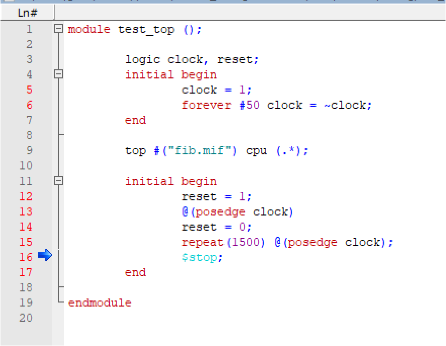
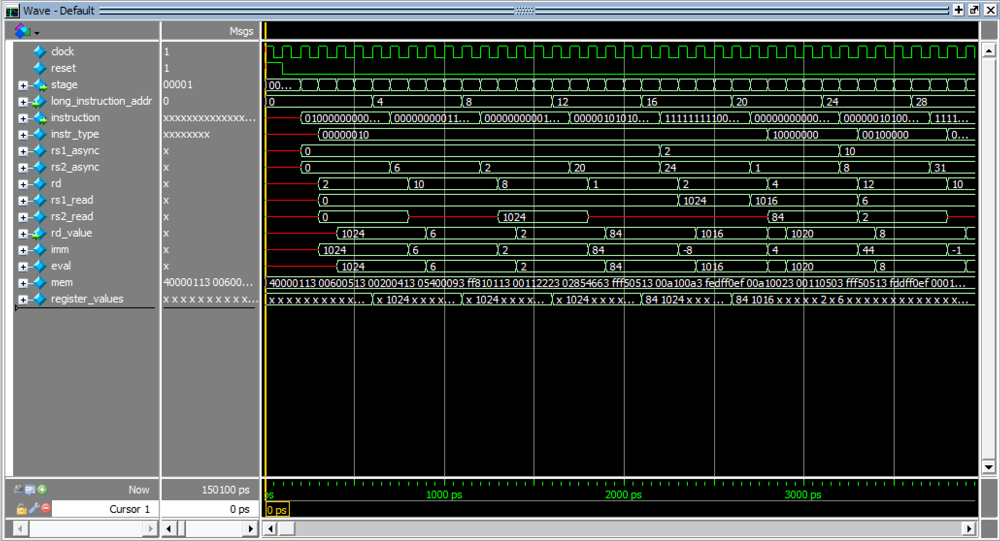

# RISC-V 7 Stage Processor

## DESCRIPTION

This is an implementation for a RISC-V processor split into 7 stages of operation. The modules are split into 5 folders and a common file. The 5 folders are for fetching instruction, decoding the instructions, executing the instruction (ALU), data memory write, and data memory read/program counter (including branch/jump handling).
The processor is currently not pipelined and only takes one instruction for each 7 cycle span.

# Lab 1 Supported Operations

## R Type:
ADD/SUB

## I Type:
ADDI

LW/LH/LB

## S Type:
SW/SH/SB

## B Type:
BEQ/BNE/BLT/BGE

## J Type:
JAL/JALR

# Testcase

## test_top

